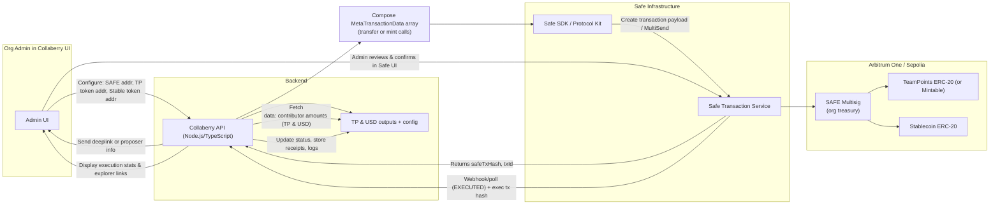
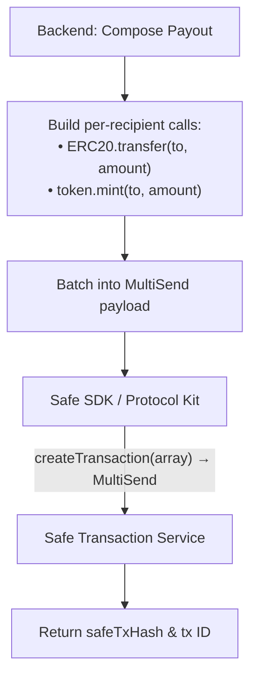
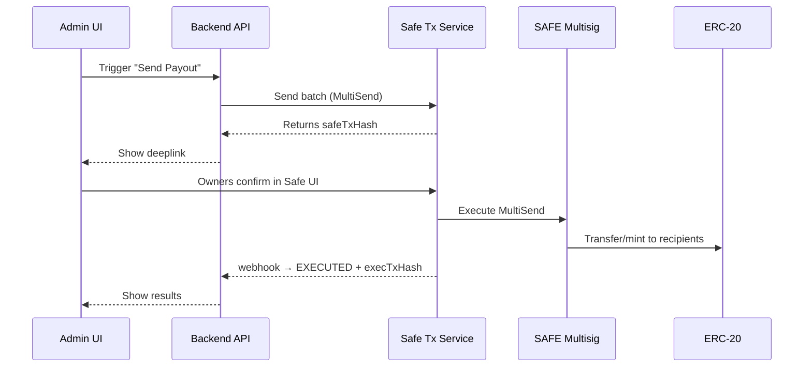

# CollabBerry: Token & Stablecoin Payout Automation via SAFE Multisig

**Functional Specification:** [Notion Link](https://elderly-accordion-7b3.notion.site/Functional-Specification-Token-Payments-via-SAFE-Multisig-1-2426b904fab281e78af2f551c57c12ec)

---

## Overview

CollabBerry enables contributor compensation via **Team Points (TP)** and monetary payouts. This gig automates stablecoin and token-based payouts using **Gnosis Safe multisig**, following the detailed Functional Specification.

---

## Scope & Deliverables

### Backend Integration
- Org-level settings: SAFE and token addresses
- Preview payouts (TP → token, USD → stable)
- Batch payouts using Safe **MultiSend**
- Safety checks: token decimals, SAFE balances, minting permissions
- Integration with **Safe SDK** and **Safe Transaction Service**

### Admin UI Enhancements
- SAFE and token configuration UI
- Preview panel + Safe deeplink
- “Send Stablecoin” and “Send Recognition Token” buttons
- Execution feedback: status, receipts, explorer links, CSV & JSON export

### Edge Cases & Resilience
- Insufficient balance warnings
- “Dust” rounding logic
- Batching up to ~200 recipients, with optional chunking

### Testing & Documentation
- Unit & integration tests (with Safe SDK mocks)
- Manual verification guide for Arbitrum Sepolia
- Up-to-date README + architecture documentation

---

## Architecture Diagrams

### 1) High-Level System Context

2) Transaction Composition & Safe Proposal

3) Transaction Execution Flow

## Acceptance Criteria (Trimmed High-Value Set)

These key tests must pass before merging:

### 1. Unit Tests
- **A1**: Verify correct token decimals conversion.  
- **A2**: Ensure MultiSend batch builder works as expected.

### 2. Integration Tests
- **B1**: Confirm that payout proposal returns a `safeTxHash` via Safe SDK + Transaction Service.  
- **B2**: On `EXECUTED` webhook, backend should update payout status and store `execTxHash`.

### 3. Security Checks
- **E1**: Only admins can initiate payouts; non-admins receive a 403 response.  
- **E2**: Payload integrity must be enforced—server recalculates data from the DB, ignoring any tampered input.

### 4. Smoke Test (End-to-End)
- **Sm**: A happy-path flow on Arbitrum Sepolia—initiate → propose → owners confirm → execution occurs—and artifacts (`safeTxHash`, `execTxHash`, explorer link, etc.) are captured.

### 5. Miscellaneous Checks
- **G1–G4**: Ensure PRs are merged to `main` for both frontend and backend repos, documentation is updated, and diagrams/examples are included.

---

## Ideal Candidate
- Proven experience in **Node.js/TypeScript** and REST API development.  
- Deep understanding of **ERC-20 token mechanics**, **Safe multisig flows**, and `mint` vs `transfer` logic.  
- Comfortable building modern **admin UIs** integrated with the Safe SDK.  
- Security-first mindset with strong awareness of auditability and failure handling.

---

## Budget & Repositories
- **Budget**: **USD 3,200** (fixed)  
- **Repositories**:  
  - Backend: [https://github.com/collabberry/backend](https://github.com/collabberry/backend)  
  - Frontend: [https://github.com/collabberry/frontend](https://github.com/collabberry/frontend)

---

## Resolver
[https://github.com/migrenaa](https://github.com/migrenaa)
